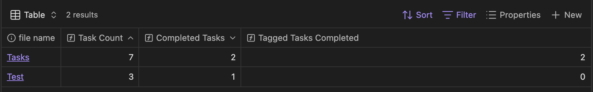

# Bases Tasks

Bases Tasks allows for better [Obsidian Bases](https://help.obsidian.md/bases) support for todo list tasks. It tracks the number of completed and ongoing tasks in a document via the `tasks` property. This can be collected and tracked using Bases.

## Useful Formulas
### Total Task Count
`tasks.length`

### Ongoing Task Count
`tasks.filter(value.toString().startsWith("- [ ]")).length`

### Completed Task Count
`tasks.filter(value.toString().startsWith("- [x]")).length`

### Completed Tasks With Tag Count
`tasks.filter(value.toString().startsWith("- [x]") && value.toString().contains("#TAG")).length`

## Daily Notes Integration
This plugin also works well with [Daily Notes](https://help.obsidian.md/plugins/daily-notes). You can set your Daily Notes folder in the Bases Tasks setting, allowing for shortcuts like right clicking a task to add it to your daily note, and attaching any tags associated with the note it came from.

## Support
